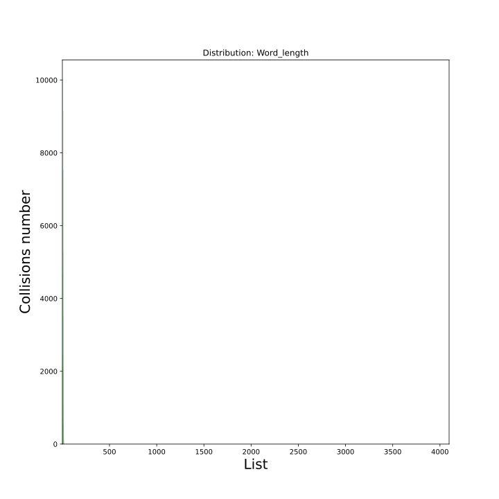
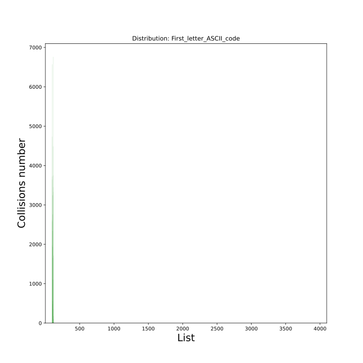
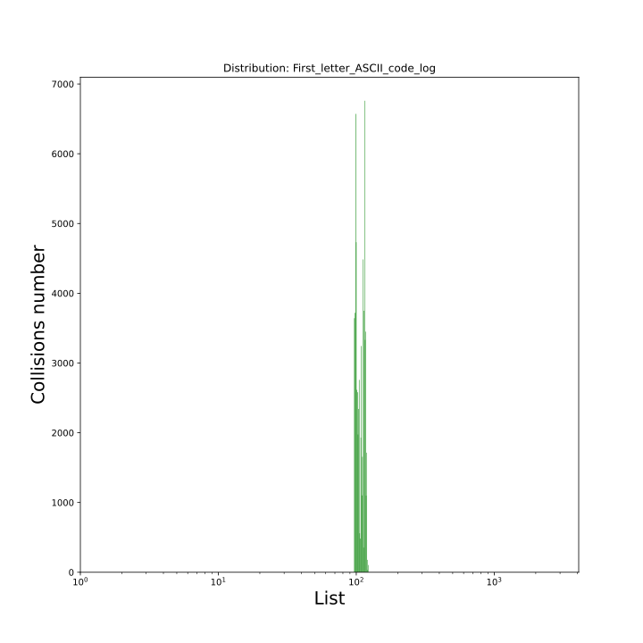
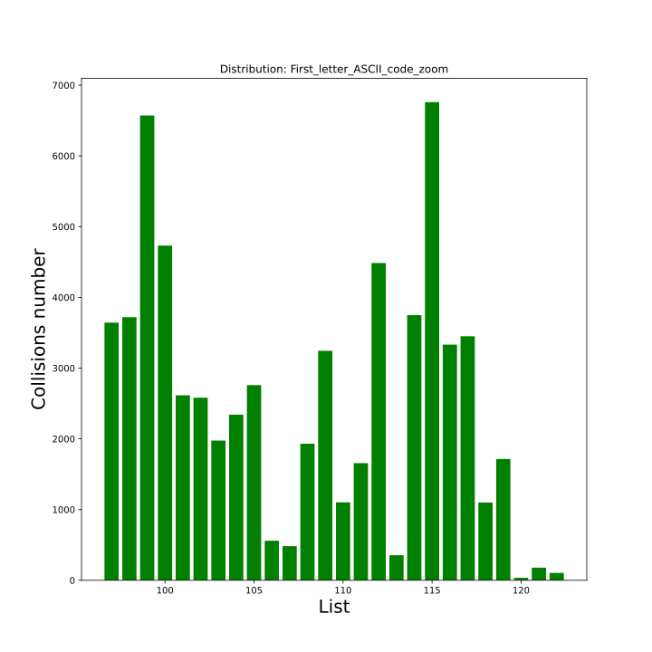
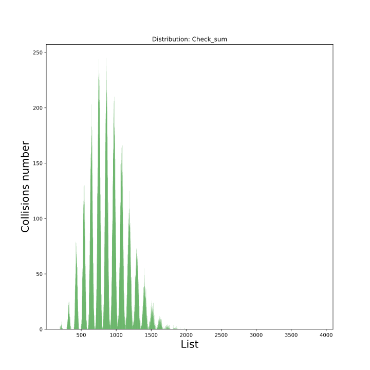

# Hash table

This project consists of two parts:
	
1. Hash functions comparison
2. Hash table low-level optimize

Content:

Part 1: Hash functions comparison

1. [Always ones](#1-ones)
2. [String length](#2-length)
3. [First letter ASCII code](#3-first-letter-ascii)
4. [Check sum](#4-check-sum)
5. [PJW hash](#5-pjw-hash)
6. [Rol hash](#6-rol-hash)

[Conclusion for part 1](#conclusion-for-part-1)

Part 2: Hotspots optimizations

0. [No optimizations](#0-no-optimizations)
1. [SIMD strings comparison](#1-simd-string-comparison)
2. [Assembly hash function](#2-assembly-hash-function)
	2.1 [Separate compilation](#21-separate-compiled-assembled-hash-function)
	2.2 [Inline asm](#22-gcc-inline-asm-extended-asm)
3. [Modulo replacement](3-from--to-and)
4. [Assembly while cycle](#4-while-cycle-assembly)

[Conclusion for part 2](#conclusion)

[P.S: ma_strlen_avx](#ps)


## PART 1: Hash functions comparison

We will compare hash functions to use one of them in hash table. So we will examine them for **density of filling the hash table**.

Functions to explore:

1. Ones (always returns one)
2. First letter ASCII
3. Length
4. Check sum (returns sum of word letters' ASCII-codes)
5. [Rol hash](https://github.com/matmuher/hash_table_optimize#6-rol-hash)
6. [PjwHash](https://en.wikipedia.org/wiki/PJW_hash_function)

### 1. Ones

This plot shows collisions' distribution. It's expected that all collisions belongs to 1st cell.


We can notice it if choose log scale


        
Search in hash table should take same time for any word. With Ones hash function **first added word** will be found with only **one string comparison**, but to find **the last added word** we have to go **through all hash table's words** (in my case it's about 65,000 words). It is awful!


 
 ### 2. Length
 
 Hash function returns length of string. 
 
  

Let's have a look in log scale. All values are distributed around **10**. 


        
 Better, but still poor performance as we have to search about **3000**! (*it's not factorial it's my amusement*) to find the word.

### 3. First letter ASCII


The situation is better with First letter ASCII. We even see something in non-log scale.



But in log scale we see that all words are disturbed around 100. It is rather logically, because low case (in dictionary all words are low cased) ASCII English letters have codes from 97 to 122. 



And if we zoom in neighborhood of 100, we see that it has more uniform distribution than previous one.



### 4. Check sum


Check sum give us the first usable result. And again quite expected: from previous plots we know that average length of word is about 10 and average ASCII code is about 100. So check sum for some average word would be 10 * 100 = 1000. And we indeed have a peak about 1000!



Such predictability is fun, but it's bad for hash function.'Average' words would be put in peak cell, so search of them would take much more time than search of rarer words. 

In this case we can compare check sum with first letter ASCII. First letter ASCII is more uniform in its range than check sum. On the other hand check sum has wider range. If we combine them we would get pretty nice hash function.


___
*Next 2 functions are quite similar so their comparison is in the "Conslusion for part 1"*
___


### 5. PJW hash

According to [wikipedia](https://en.wikipedia.org/wiki/PJW_hash_function) implementation of this hash's algorithm is used in ELF format. Its code:
```
uint32_t pjw_hash (const char* key)
{
    uint32_t hash = 0;

    while(*key)
    {
        hash = (hash << 4) + *key++;
        uint32_t g = hash & 0xf0000000;
        if (g != 0)
        {
            hash = hash ^ (g >> 24);
            hash = hash ^ g; 
        }                   
    }

    return hash;
}
```


According to the plot this hash table is filled respectively uniformly:


 [6]:
### 6. Rol hash
 
 Its code:
```
uint32_t rol_hash (const char* key)
{
    uint32_t hash = *key++;

    while(*key)
    {
        // ror(hash) ^ key[letter_id]
        hash = ( (hash << 1) | (hash >> 31) ) ^ (*key++);
    }

    return hash;
}
```

 
 Distribution:
 


Now it's not so obvious which hash function is better so I carried measurements: 
 
 

### Conclusion for part 1

| Hash function 			|Average size| Dispersion  | Filling coefficient |
| -----------   			|---| ----------- |---|
| Ones        			|65197.0| 	0.0 	| 0.000 |
| Length 				|2963.5|	3571.8	| 0.005 |
| First letter ASCII     |2507.6| 1816.1	| 0.006 | 
| Check sum				|42.2|	55.5		| 0.377 | 
| PJW hash				|19.8|	29.5		| 0.804 |
| Rol hash				|16.0|	10.2		| 0.993 |


In this table:

* Average size stands for average size of not empty cell.
* Dispersion is also belongs to not empty cells
* Filling coefficient is computed so: $Filling~ coefficient~ =~ \frac{N(cells~ with~ content)}{hash~ table~ size}$

Due to this statistic **Rol hash is the best hash function among mentioned ones**. *But frankly speaking according to plots it seems that pjw is more uniform, but I don't how to prove it with computations...*

## PART 2: Hotspots optimizations

Use case is searching in hash table. So to measure optimizations' effect following stress test will be used:

### Stress test

We will **search every word** from [English dictionary](english2.txt) **1000 times**. To decrease influence of random errors test will be done 5 times. There are about 65,000 words in the dictionary.

### 0. No optimizations

So without any optimizations we have such results:


|Compiler flag	|-O0|-O1|-O2|
|---				|---|---|---|
|Test 0			|10.14|5.71|	5.81|
|Test 1			|10.09|5.68|	5.67|
|Test 2			|10.03|5.66|	5.68|
|Test 3			|10.11|5.65|	5.68|
|Test 4			|9.79|5.65 |	5.89|
|Average			|10.04|5.67|	5.74|

### Tools to determine hotspots

To determine hotspots **callgrind** ([vallgrind](https://valgrind.org/docs/manual/cl-manual.html)'s tool) and [**kcachegrind**](http://kcachegrind.sourceforge.net/html/Home.html) (for checking callgrind generated data) are used. 

Let's check callgrind's report for non optimized hash table:

*(Don't be afraid of 'ror_hash'. It's still 'rol_hash', I periodically have a mess with right and left after good vacation)*

 
        
Most number of calls belongs to string comparison. So that is what our the first optimization will be devoted for.

### 1. SIMD string comparison

To boost comparison AVX and AVX2 intrinsics will be used. We will cast strings to __m256i data types so that we can compare any two words with 3 instructions. As well that means that we will process only words with length <= 31. This constraint is price of speed. *But indeed we don't have much of so long words in dictionary* : )

```
hash_cell* search_in_hash_table (hash_table_t* ma_hash_table, const char* key)
{
    uint32_t hash_index = ma_hash_table->hash_func(key) % ma_hash_table->HASH_TABLE_SIZE;
    hash_cell* collide_cell = ma_hash_table->hash_table + hash_index;

    while (collide_cell)
    {
        if (collide_cell->data && !strcmp(collide_cell->data, key)) return collide_cell;

        collide_cell = collide_cell->next_collision_element;
    }

    return NULL;
}
```

        
```
hash_cell* search_in_hash_table (hash_table_t* ma_hash_table, __m256i key)
{
    uint32_t hash_index = ma_hash_table->hash_func((char*) &key) % ma_hash_table->HASH_TABLE_SIZE;
    hash_cell* collide_cell = ma_hash_table->hash_table + hash_index;

    while (collide_cell)
    {
        __m256i cmp_mask = _mm256_cmpeq_epi8(collide_cell->data, key);
        int cmp_status = _mm256_movemask_epi8(cmp_mask);

        if (cmp_status == SIMD_EQUAL_MASK) return collide_cell;

        collide_cell = collide_cell->next_collision_element;
    }

    return NULL;
}

```

        
Stress test results:

|Compiler flag	|-O0|-O1|-O2|
|---				|---|---|---|
|Test 0			|9.44|3.37|3.29|
|Test 1			|9.70|3.28|3.42|
|Test 2			|9.58|3.38|3.57|
|Test 3			|9.76|3.23|3.30|
|Test 4			|9.46|3.41|3.31|
|Average			|9.59|3.33|3.38|


Boost:

* -O0: 1.05 times
* -O1: 1.70 times
* -O2: 1.70 times

Let's again explore hotspots:

 

We can see cost that belongs to ror_hash increased. It's all okay, because as we've seen total cost decreased. But as we did not do anything with hash function, its cost remained without changes. So its time contribution percentage increased. 

Thus, next step would be:

### 2. Assembly hash function

#### 2.1 Separate compiled assembled hash function

Lets' assemble hash function. That's its assembled code:

```
;	[ROL_HASH]

global A_rol_hash

section .text

A_rol_hash:
		xor rax, rax ; int hash = 0
		lea rsi, [rdi + 1]	; str -> rsi
		movzx rdi, byte [rdi]
	.for:
		lodsb
		test al, al
		jz .end
		rol edi, 1
		xor edi, eax  
		jmp .for
	.end:
		xchg eax, edi

		ret
```

        
Moreover when defining hash function in hash_table.h we can use `__attribute__ ((naked))` to avoid automatically creating of prologue and epilogue (avoid using of stack).

Stress test results:

|Compiler flag	|-O0|-O1|-O2|
|---				|---|---|---|
|Test 0			|7.92|3.27|3.28|
|Test 1			|8.16|3.26|3.47|
|Test 2			|8.19|3.46|3.41|
|Test 3			|8.00|3.40|3.29|
|Test 4			|8.31|3.34|3.29|
|Average			|8.12|3.35|3.35|

Boost:

* -O0: 1.18 times
* -O1: 1.03 times
* -O2: 1.02 times

Separate compilation results are not so satisfied with -O2 and -O3. So let's try using inline assembly. 

#### 2.2 GCC inline asm (Extended Asm)

We will do it with GCC Extened Asm. It has a specific syntax so, if you are going to use it, I strongly recommend to check [GCC docs](https://gcc.gnu.org/onlinedocs/gcc/Extended-Asm.html) and if you're Russian there is [pretty short note](https://ru.wikipedia.org/wiki/GCC_Inline_Assembly) about inline asm and AT&T syntax. That's what we've got:

```
  asm	(
	"xorq %%rax, %%rax\n\t"
	"leaq 1(%1), %%rsi\n\t"
	"movzbl (%1), %0\n\t"
".for:\n\t"
	"lodsb\n\t"
	"cmp $0, %%rax\n\t"
	"je .end\n\t"
	"rol $1, %0\n\t"
	"xorl %%eax, %0\n\t"  
	"jmp .for\n\t"
".end:\n\t"
	"nop\n\t"
	
        : "+rm" (hash_index) 
        
        : "r" ((char*) &key), "rm" (ma_hash_table->HASH_TABLE_SIZE - 1)
        
        : "cc", "rax", "rsi"
        );
```

Stress test results:

|Compiler flag	|-O0|-O1|-O2|
|---				|---|---|---|
|Test 0			|8.07|3.23|3.21|
|Test 1			|8.08|3.22|3.20|
|Test 2			|8.06|3.24|3.22|
|Test 3			|8.11|3.21|3.20|
|Test 4			|8.05|3.22|3.19|
|Average			|8.07|3.22|3.20|

Boost:

* -O0: 1.19 times
* -O1: 1.04 times
* -O2: 1.06 times

Seems better!

And in callgrind report we get one big function that grabs all costs:

 
        
Let's see details:

 
        
Oh! Modulo...

### 3. From '%' to 'and'

Modulo is expensive operation. We should pay attention to this line:


```hash_index = hash_index % (ma_hash_table->HASH_TABLE_SIZE); ``` 

Now let's remember that hash table's size is $4096 = 2^{12}$. Thus for modulo we can use 'and' instruction with `mask = 4096 - 1 (in decimal)= 111 1111 1111 1111 (in binary)`. 

```
asm 	(
	"andl %0, %1\n\t"
	
	: "=rm" (hash_index) 
	
	: "rm" (ma_hash_table->HASH_TABLE_SIZE - 1)
	);
```

Stress test results:

|Compiler flag	|-O0|-O1|-O2|
|---				|---|---|---|
|Test 0			|7.37|2.58|2.62|
|Test 1			|7.36|2.59|2.69|
|Test 2			|7.39|2.59|2.81|
|Test 3			|7.54|2.58|2.80|
|Test 4			|7.54|2.59|2.65|
|Average			|7.44|2.58|2.71|

Boost:

* -O0: 1.08 times
* -O1: 1.25 times
* -O2: 1.18 times

Fine! We still did not do anything with while cycle of searching in list. Let's try to do something with it.

### 4. While cycle assembly 

We can rewrite it with GCC Extended Asm:

```
asm	(
	"vmovaps %3, %%ymm0\n\t"
	".while:\n\t"
	"cmp $0, %0\n\t"
	"je .while_end\n\t"
	"vmovaps (%0), %%ymm1\n\t"
	"vpcmpeqb %%ymm0, %%ymm1, %%ymm3\n\t"
	"vpmovmskb %%ymm3, %1\n\t"
	"cmp %1, %4\n\t"
	"jne .skip\n\t"
	"movq %0, %2\n\t"
	"jmp .while_end\n\t"
".skip:\n\t"
	"movq 32(%0), %0 \n\t"
	"jmp .while\n\t"
".while_end:\n\t"
	"nop\n\t"
	
	:"+r" (collide_cell), "+r" (cmp_status), "+r" (found_cell)

	:"rm" (key), "rm" (SIMD_EQUAL_MASK)
	
	: "rax", "ymm0", "ymm1", "ymm3"
	);
```

Stress test results:

|Compiler flag	|-O0|-O1|-O2|
|---				|---|---|---|
|Test 0			|4.05|2.27|3.14|
|Test 1			|3.85|2.23|3.14|
|Test 2			|3.87|2.19|3.15|
|Test 3			|4.02|2.30|3.13|
|Test 4			|4.04|2.25|3.13|
|Average			|3.96|2.25|3.14|

Boost:

* -O0: 1.88 times
* -O1: 1.15 times
* -O2: 0.86 times (anti boost!)

Okay, we now have got decrease in performance and just have a look at our search function. How ugly and non-portable it is!

 
        
That brings us to the end of optimization.

## CONCLUSION

Total boost:

* -O0: 2.55 times
* -O1: 2.52 times
* -O2: 1.82 times

It's really great, but still we have to remember about cost — constraints such as:

* AVX and AVX2 are required
* Words should be shorter than 32 symbols
* x86 instruction set
* Hash table should be power of 2

All in all, we have got fast, **NON-PORTABLE**, **UNREADABLE** and **HARD TO SUPPORT** code. *Good job!*

## P.S.

In first versions I computed length of string in every call of hash. Before thinking I optimized strlen function with AVX:
```
uint32_t ma_strlen(__m256i key)
{
    return YMM_SIZE - __builtin_popcount(_mm256_movemask_epi8(_mm256_cmpeq_epi8(_mm256_setzero_si256(), key)));
}
```
But soon I understood that I don't even need to compute string's length every time. Thus, before assembling it's worth thinking whether you really need this optimization.
